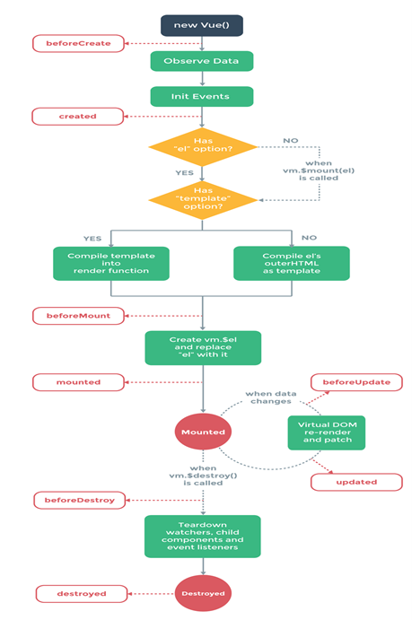

# hello-vue

## Project setup

```
npm install
```

### Compiles and hot-reloads for development

```
npm run serve
```

### Compiles and minifies for production

```
npm run build
```

### Lints and fixes files

```
npm run lint
```

### Customize configuration

See [Configuration Reference](https://cli.vuejs.org/config/).

## What is life cycle in Vue.js

 <br>

- Looking in the picture something have to know :
  1. When we mount ==> Do something
  2. When before update ==> Do something
  3. When update ==> Do something
